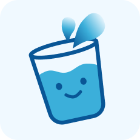

<div align="center">
  
  
  # 💧 SipSip Water Tracker
  
  **Teman Setia Hidrasimu Sehari-hari**
  
  [](https://flutter.dev/)
  [](https://dart.dev/)
  [](https://firebase.google.com/)
  
  <p align="center">
    Jaga tubuh tetap bugar dan terhidrasi dengan pemantau asupan air cerdas yang dirancang khusus untuk Anda.
  </p>
</div>

---

## 📖 Tentang Aplikasi

**SipSip Water Tracker** bukan sekadar aplikasi pengingat minum biasa. Ini adalah asisten kesehatan pribadi yang mengerti kebutuhan tubuh Anda. Dibuat dengan cinta menggunakan **Flutter**, aplikasi ini membantu Anda membangun kebiasaan minum air yang sehat dengan cara yang menyenangkan dan mudah.

Apakah Anda sering lupa minum di tengah kesibukan? Atau bingung berapa banyak air yang sebenarnya tubuh Anda butuhkan? **SipSip** hadir sebagai solusi!

---

## ✨ Fitur Utama

Nikmati pengalaman pengguna yang mulus dengan fitur-fitur unggulan kami:

- **🎯 Target Hidrasi Personal**: Algoritma cerdas kami menghitung kebutuhan air harian Anda berdasarkan berat badan, aktivitas, dan cuaca.
- **🔔 Pengingat Pintar**: Notifikasi yang ramah dan dapat disesuaikan agar Anda tidak pernah melewatkan waktu minum, tanpa merasa terganggu.
- **📊 Statistik & Riwayat**: Pantau kemajuan Anda dengan grafik yang indah. Lihat riwayat harian, mingguan, hingga bulanan untuk menjaga motivasi.
- **🏆 Gamifikasi Simpel**: Rasakan kepuasan saat mencapai target harian Anda.
- **🔒 Privasi Terjamin**: Data kesehatan Anda tersimpan aman secara lokal dengan dukungan sinkronisasi cloud opsional.

---

## 🛠️ Teknologi yang Digunakan

Aplikasi ini dibangun menggunakan teknologi terkini untuk memastikan performa yang cepat dan handal:

- **Frontend**: [Flutter](https://flutter.dev) (Framework UI Google yang indah)
- **Local Database**: [Hive](https://docs.hivedb.dev/) (Penyimpanan lokal super cepat)
- **Backend & Auth**: [Firebase](https://firebase.google.com/) (Autentikasi aman dan notifikasi real-time)
- **State Management**: [Provider](https://pub.dev/packages/provider) (Manajemen data yang efisien)
- **Notifications**: Flutter Local Notifications

---

## 🚀 Cara Install

Ikuti langkah mudah ini untuk menjalankan SipSip di perangkat lokal Anda:

1. **Clone Repository**
   ```bash
   git clone https://github.com/Start-Play-M-SIB-6/WaterTracker-Sipsip-.git
   ```

2. **Masuk ke Direktori**
   ```bash
   cd watertracker
   ```

3. **Install Dependencies**
   ```bash
   flutter pub get
   ```

4. **Jalankan Aplikasi**
   ```bash
   flutter run
   ```

---

## 👥 Tim Pengembang

Dibalik aplikasi hebat, ada tim yang luar biasa. Kenalan yuk dengan kami!

<div align="center">
  <table>
    <tr>
      <td align="center">
        <br>
        <b>Yazid</b><br>
        <sub>Mobile Developer</sub>
      </td>
      <td align="center">
        <br>
        <b>Fahmi</b><br>
        <sub>Mobile Developer</sub>
      </td>
      <td align="center">
        <br>
        <b>Dyo</b><br>
        <sub>Mobile Developer</sub>
      </td>
      <td align="center">
        <br>
        <b>Keanu</b><br>
        <sub>Mobile Developer</sub>
      </td>
    </tr>
  </table>
</div>

<br>

<div align="center">
  <sub>Dibuat dengan 💙 oleh Tim SipSip</sub>
</div>
