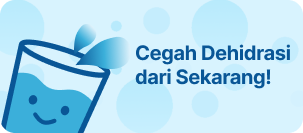

  
  
  # 💧 SipSip Water Tracker
  
  **"Sahabat Sehatmu, Setiap Tetes Berarti"**
  
  
  
  
  
  ---
  
  

    <a href="#-latar-belakang-masalah">Latar Belakang</a> •
    <a href="#-solusi-kami">Solusi</a> •
    <a href="#-target-pasar">Market</a> •
    <a href="#-fitur-unggulan">Fitur</a> •
    <a href="#-teknologi">Teknologi</a> •
    <a href="#-tim-pengembang">Tim</a>
  

 

## 🧐 Latar Belakang Masalah

Di tengah kesibukan dunia modern, kesehatan dasar seringkali terabaikan.
> **Tahukah Anda?** Dehidrasi ringan saja dapat menurunkan konsentrasi, memicu sakit kepala, dan mempengaruhi suasana hati.

Banyak orang:
- ❌ **Lupa minum** karena terlalu fokus bekerja atau belajar.
- ❌ **Tidak tahu** berapa kebutuhan air harian tubuh mereka sebenarnya.
- ❌ **Merasa malas** minum air putih karena tidak ada motivasi.

Masalah sederhana ini, jika dibiarkan, dapat berdampak serius pada kesehatan jangka panjang.

---

## 💡 Solusi Kami

**SipSip Water Tracker** hadir bukan sekadar sebagai pengingat, tapi sebagai pendamping gaya hidup sehat Anda.

Kami menawarkan pendekatan **Personal & Menyenangkan**:
1.  **Kalkulasi Cerdas**: Menghitung kebutuhan air berdasarkan berat badan, aktivitas, dan cuaca di lokasi Anda (bukan sekadar "8 gelas sehari").
2.  **Sistem Pengingat Tematis**: Notifikasi yang tidak membosankan, disesuaikan dengan waktu bangun dan tidur Anda.
3.  **Gamifikasi**: Mencatat minum air menjadi memuaskan dengan visualisasi progress yang menarik.

---

## 🎯 Target Pasar

Aplikasi ini dirancang dengan cinta untuk:

| Persona | Kebutuhan |
| :--- | :--- |
| **🏢 Pekerja Kantoran** | Pengingat di sela-sela jam kerja padat di ruangan ber-AC. |
| **🎓 Mahasiswa/Pelajar** | Menjaga fokus belajar dengan hidrasi yang cukup. |
| **🏃‍♂️ Penggiat Olahraga** | Memantau rehidrasi setelah aktivitas fisik intens. |
| **🏥 Sadar Kesehatan** | Individu yang ingin memperbaiki metabolisme dan kulit melalui air. |

---

## ✨ Fitur Unggulan

<b>🌊 Smart Reminder System (Klik untuk detail)</b>

 
Sistem pengingat kami tidak sembarangan. SipSip belajar dari jam tidur dan bangun Anda untuk mengirimkan notifikasi hanya di saat Anda aktif. Tidak ada lagi alarm yang mengganggu di tengah malam!

<b>📊 Statistik Hidrasi Canggih (Klik untuk detail)</b>

 
Pantau perjalanan sehatmu dengan grafik interaktif.
- 📅 <b>Harian</b>: Cek asupan per jam.
- 📈 <b>Bulanan</b>: Analisis tren hidrasimu.

<b>⚙️ Personalisasi 100% (Klik untuk detail)</b>

 
Sesuaikan ukuran gelas, botol, atau mug favoritmu. Atur target harian secara manual jika sedang dalam kondisi medis tertentu.

 

  
  
<i>Tetap terhidrasi dengan pengingat visual yang menarik</i>

---

## 🛠️ Teknologi

Dibangun dengan fondasi teknologi yang kokoh untuk pengalaman pengguna terbaik:

- **Frontend**: Flutter (Best-in-class UI performance)
- **Local Storage**: Hive (Database NoSQL super cepat)
- **Backend & Auth**: Firebase Ecosystem
- **State Management**: Provider
- **Notifications**: Flutter Local Notifications Plugin

---

## 👥 Tim Pengembang

Tim kreatif dibalik SipSip yang berdedikasi menghadirkan aplikasi kesehatan terbaik:

  <table>
    <tr>
      <td align="center" width="130">
        
          
        <b>Muh Yazid</b> 
        1237050107
      </td>
      <td align="center" width="130">
        
          
        <b>M. Fahmi</b> 
        1237050074
      </td>
      <td align="center" width="130">
        
          
        <b>Dyo</b> 
        1237050076
      </td>
      <td align="center" width="130">
        
          
        <b>Keanu</b> 
        1237050061
      </td>
    </tr>
  </table>

---

  <h3>💧 SipSip - Karena Tubuhmu Layak Mendapatkannya 💧</h3>
   
  Copyright © 2025 SipSip Team. All rights reserved.

